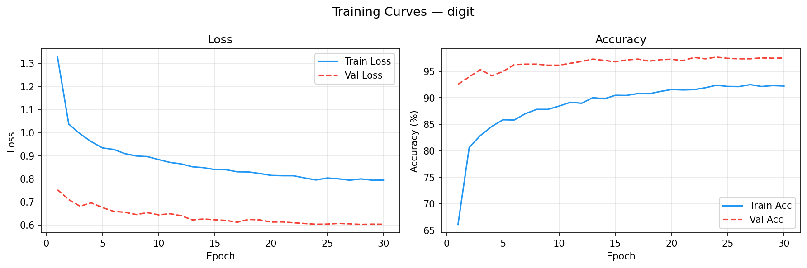
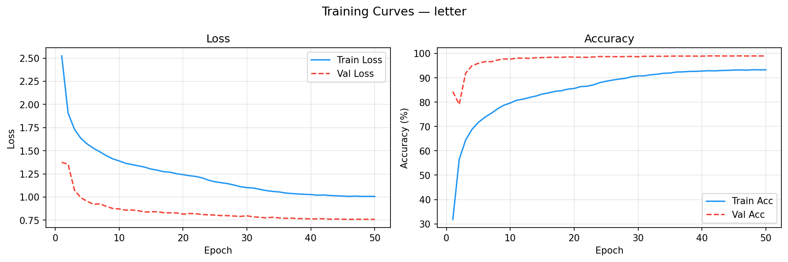

# Tibetan HWR · 藏文手写识别系统

基于 PyTorch 的藏文手写**数字**（10 类）与**字母**（30 类）识别，配 FastAPI + Canvas 在线演示。

- **端到端**：原始扫描图预处理 → 数据集构建 → CNN 训练 → Web 推理
- **两款模型**：`DigitCNN`（~420K 参数，含 BatchNorm）与 `LetterCNN`（~2.3M 参数，含 BatchNorm）
- **开箱即用**：单命令训练、单命令启动 Web 服务，内置 TensorBoard 日志

---

## 快速开始

```bash
# 1. 安装依赖
pip install -r requirements.txt

# 2. 下载预训练模型（推荐，跳过训练直接体验）
#    从 GitHub Releases 下载 digit_best.pth 和 letter_best.pth，放入 checkpoint/
#    https://github.com/cairangxianmu/tibetan-hwr/releases/latest

# 3. 准备数据集（可选，仅需重新训练时）
#    放置后目录应为 dataset/TibetanMNIST28x28/ 与 dataset/TibetanLetter64x64/

# 4. 启动 Web 服务
cd web
uvicorn app:app --port 8000
# → http://localhost:8000
```

---

## 项目结构

```
tibetan-hwr/
├── dataset/                 # 数据集（需自行放置）
│   ├── TibetanMNIST28x28/   #  10 类数字，28×28 PNG，17,768 张
│   └── TibetanLetter64x64/  #  30 类字母，64×64 PNG，77,636 张
├── image_processing/        # 原始扫描图预处理（可选）
│   ├── letter_processor.py  #  红格纸 → 单字母
│   ├── digit_processor.py   #  深色底 → 单数字
│   └── utils.py             #  重命名 / 去红线 / 批量缩放
├── recognition/             # 训练与模型
│   ├── model.py             #  DigitCNN / LetterCNN
│   ├── dataset.py           #  DataLoader 工厂 + 字符映射表
│   └── train.py             #  训练入口
├── checkpoint/              # 训练输出的模型权重（{mode}_best.pth）
├── runs/                    # 训练日志（按时间戳分目录）
├── web/                     # Web 服务
│   ├── app.py               #  FastAPI 后端
│   └── static/              #  前端（Canvas + 原生 JS）
└── requirements.txt
```

---

## 数据集

| 目录                 | 尺寸  |      类别      | 样本数 |
| :------------------- | :---: | :------------: | :----: |
| `TibetanMNIST28x28`  | 28×28 | 10（数字 ༠–༩） | 17,768 |
| `TibetanLetter64x64` | 64×64 | 30（字母 ཀ–ཨ） | 77,636 |

**下载**：[百度网盘](https://pan.baidu.com/s/1TnM9Rxue9ae0bhPJ2EUP8g?pwd=4ata)　提取码 `4ata`

下载后解压为以下结构：

```
dataset/
├── TibetanMNIST28x28/{0..9}/*.png
└── TibetanLetter64x64/{0..29}/*.png
```

子文件夹名即类别标签，数据集遵循 `torchvision.datasets.ImageFolder` 约定。

---

## 预训练模型

从 [GitHub Releases](https://github.com/cairangxianmu/tibetan-hwr/releases/latest) 下载：

| 文件              |  大小  | 验证准确率 |
| :---------------- | :----: | :--------: |
| `digit_best.pth`  | 1.7 MB |   97.5%    |
| `letter_best.pth` | 8.4 MB |   99.0%    |

下载后放入 `checkpoint/` 目录，直接启动 Web 服务即可使用。

---

## 训练曲线

**数字模型**（30 epoch，val_acc 97.5%）



**字母模型**（50 epoch，val_acc 99.0%）



---

## 训练

```bash
cd recognition
python train.py --mode {digit|letter} [options]
```

**常用参数**

| 参数                |      默认值      | 说明                                |
| :------------------ | :--------------: | :---------------------------------- |
| `--mode`            |      _必填_      | `digit` 或 `letter`                 |
| `--epochs`          |        30        | 最大训练轮数                        |
| `--lr`              |       1e-3       | 初始学习率（Adam）                  |
| `--batch-size`      |        64        | 批大小                              |
| `--val-split`       |       0.2        | 验证集比例（固定种子 42）           |
| `--patience`        |        10        | 早停容忍 epoch 数；0 禁用           |
| `--label-smoothing` |       0.1        | CrossEntropyLoss 标签平滑系数       |
| `--weight-decay`    |       1e-4       | Adam weight_decay                   |
| `--save-every`      |        5         | 每 N epoch 保存周期检查点           |
| `--keep-ckpts`      |        3         | 保留最近 N 个周期检查点；0 保留全部 |
| `--data-root`       |       自动       | 覆盖数据集路径                      |
| `--save-dir`        | `../checkpoint/` | 权重保存目录                        |
| `--log-dir`         |    `../runs/`    | 日志根目录                          |
| `--no-plot`         |        -         | 禁用 matplotlib 曲线输出            |

**训练配置**：Adam + `weight_decay=1e-4`，`CosineAnnealingLR` 退火到 `eta_min=1e-6`，`CrossEntropyLoss(label_smoothing=0.1)`。

**预处理**：所有图像在送入模型前经过 `GaussianBinarize`（高斯模糊 σ=1 → Otsu 二值化）。相比纯 Otsu，模糊步骤先消除抗锯齿噪点，使笔画连续性更好。

**数据增强**（仅训练集，作用于灰度图后再二值化）：

| 增强                | 参数                                       | 说明                   |
| :------------------ | :----------------------------------------- | :--------------------- |
| `RandomRotation`    | ±15°，fill=255                             | 覆盖书写倾斜范围       |
| `RandomAffine`      | translate=8%，scale=(0.85,1.15)，shear=±8° | 模拟字符大小与倾斜差异 |
| `RandomPerspective` | distortion=0.2，p=0.4                      | 模拟拍照视角偏差       |
| `RandomErasing`     | p=0.3，scale=(2%,15%)                      | 模拟笔画断裂/遮挡      |

不使用翻转——藏文字母存在镜像相似对，翻转会直接污染标签。

**早停**：验证准确率连续 `--patience` 个 epoch 无改善时自动停止，并恢复最优权重。

**周期检查点**：每 `--save-every` 个 epoch 额外保存 `{mode}_epoch{N:04d}.pth`，自动轮转保留最近 `--keep-ckpts` 个。

训练完成后，最优权重保存到 `checkpoint/{mode}_best.pth`，其中包含：

```python
{"epoch": ..., "mode": "digit"|"letter", "num_classes": ..., "model_state_dict": ..., "val_acc": ...}
```

---

## 训练日志

每次训练在 `runs/{mode}_{timestamp}/` 下生成：

| 文件                  | 内容                               |
| :-------------------- | :--------------------------------- |
| `args.json`           | 所有超参数、完整命令、设备信息     |
| `metrics.csv`         | 逐 epoch 的 loss / acc / lr / 耗时 |
| `events.out.*`        | TensorBoard 事件文件               |
| `training_curves.png` | 损失与准确率曲线图                 |

```bash
tensorboard --logdir runs/   # → http://localhost:6006
```

---

## Web 服务

```bash
cd web
uvicorn app:app --port 8000   # 加 --reload 开启热更新
```

**前端功能**

- 模式切换（数字 / 字母），切换时清空画板
- 400×400 Canvas，支持鼠标 & 触屏，可调笔画粗细（4–32 px）
- **逐笔撤销**（Ctrl+Z）——每次落笔前拍 `ImageData` 快照入栈
- 图片上传（点击或拖拽），自动居中缩放到画板
- 识别结果：目标字符、置信度进度条、Top-5 候选

**API**

```http
GET  /health
     → {"status": "ok", "device": "cpu"}

POST /predict
     Request:  {"image": "<base64 | data URL>", "mode": "digit" | "letter"}
     Response: {
       "label":      3,
       "character":  "༣",
       "confidence": 97.42,
       "top5": [{"label": 3, "character": "༣", "confidence": 97.42}, ...]
     }
```

模型采用**懒加载**：服务启动不加载任何权重，首次收到某模式请求时才从磁盘读入并缓存。

---

## 推理预处理

前端 Canvas 尺寸 400×400，但用户书写的字符通常只占画板中间一小块。若直接把整张画板缩放到 28×28 或 64×64，字符会被极度缩小，与训练数据（字符铺满整帧）分布不一致，识别率会明显下降。

`web/app.py` 在 `_preprocess` 中调用 `_tight_crop`：

推理预处理完整流程：

```
原始图像（Canvas 或上传文件）
  │
  ▼  _tight_crop：找暗像素（<200）边界框 → 扩 15% padding → 裁剪 → 填充为正方形
  ▼  Grayscale → Resize（28×28 或 64×64）
  ▼  GaussianBinarize：高斯模糊（σ=1）→ Otsu 二值化
  ▼  ToTensor → Normalize(mean=0.5, std=0.5)
模型输入（与训练验证集分布一致）
```

手写与上传图片走同一路径，保证两种输入的表现一致。

---

## 原始扫描图预处理（可选）

若你有手写原始扫描纸（红色格线方格纸），可用 `image_processing/` 将整张表单切分为单字符图像：

```bash
# 字母：红色格线方格纸（8×12 格）
python image_processing/letter_processor.py --input  sheets/ --output out/

# 数字：深色背景手写纸
python image_processing/digit_processor.py  --input  sheets/ --output out/

# 工具函数
python image_processing/utils.py rename  --dir  ./data
python image_processing/utils.py replace --dir  ./data                  # 去残留红线
python image_processing/utils.py resize  --src  ./data_200 --dst ./data_64 --size 64
```

详细流程见系列博客「TibetanHWR 系列二：OpenCV 图像预处理」。

---

## 依赖

| 分组   | 包                                              |
| :----- | :---------------------------------------------- |
| 训练   | `torch` `torchvision`                           |
| Web    | `fastapi` `uvicorn` `pillow` `python-multipart` |
| 预处理 | `opencv-python` `numpy`                         |
| 可视化 | `matplotlib` `tensorboard`                      |

---

## 引用

> 周毛克, 才让先木, 龙从军, 等. 基于卷积神经网络的藏文手写数字和字母识别研究[J].
> 青海师范大学学报(自然科学版), 2019, 35(04): 34-39.
> DOI: 10.16229/j.cnki.issn1001-7542.2019.04.006
